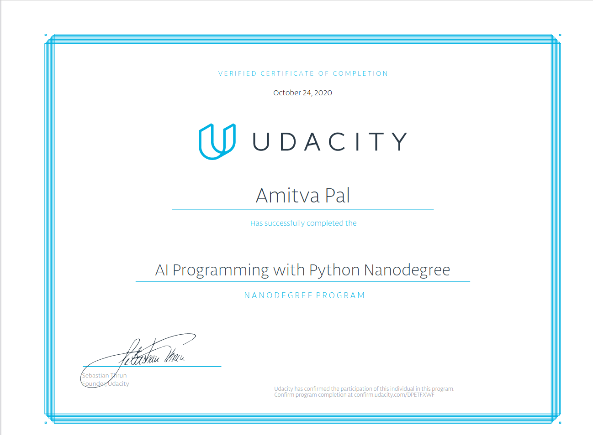

# Udacity AI Programming with Python Project
## Projects completed:
1.	[Use a Pre-trained Image Classifier to Identify Dog Breeds](https://github.com/amitvapal/UdacityAIPPND-Project-01-pre-trained-image-classifier-to-identify-dog-breeds)
2. [Create Your Own Image Classifier. In this project, we build a Python application that can train an image classifier on a dataset, then predict new images using the trained model.](https://github.com/amitvapal/UdacityAIPPND-Project-02-create-your-own-image-classifier)

### Certificate of completion

